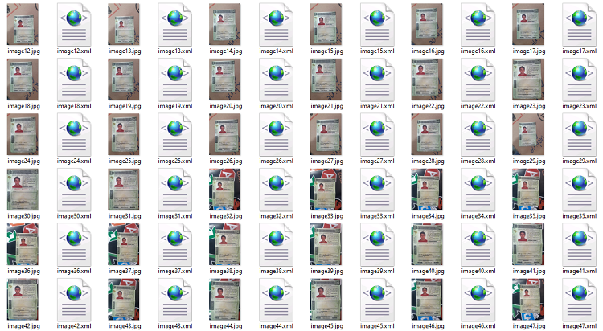

# ocr-cnh

## Requisitos
- <b>Objetivo:</b> Extrair informações de uma CNH;

- <b>Solução:</b> Devido ao grande número de ruídos em um documento CNH, decidi criar um modelo de detecção de objetos com TensorFlow 1.x, capaz de extrair de forma eficiente as caixas de diferentes campos da CNH, para enfim extrair os textos por meio de OCR;

- <b>Tarefas:</b> Treinar o modelo de detecção de campos e criar o código para extrair os textos com OCR;

- <b>Fluxo do processo:</b>
  1. Detectar os campos da CNH;
  2. Extrair os textos com OCR;
  3. Organizar o output em um dicionário.

## Treinamento do modelo
Para treinar o modelo, usei localmente a API de Detecção de Objetos do Tensorflow. Como modelo base foi utilizado o <b>Faster-RCNN-Inception-V2-COCO</b>.

- <b>Pros:</b> O modelo consegue detectar com facilidade os campos de uma CNH;

- <b>Cons:</b> Tempo de treino e de processamento da inferência.

## Dataset para Treinamento
A base de treinamento foi construída utilizando diversas fotos de apenas uma CNH em ambientes e com qualidades diferentes. Para criar os labels em cada imagem foi utilizado o software <a href="https://github.com/tzutalin/labelImg">labelImg</a>. Os labels anotados para treinamento foram: <b>Nome, RG, CPF, Data Nascimento, Filiação(pais), CNH, Validade e Categoria</b>.



Mesmo com apenas um documento, o modelo conseguiu generalizar para CNHs diferentes.

## Leitura dos campos com OCR
Nesta etapa foram utilizados apenas os labels <b>CPF, Data Nascimento e CNH</b>.

Para extração de texto dos campos foi utilizado o <a href="https://github.com/tesseract-ocr/tesseract">tesseract</a>. Cada campo recebeu tratamentos específicos de imagem com o uso do <b>OpenCV</b> e logo em seguida foi utilizado o <b>pytesseract</b> para extração dos textos.

<b>Desafios:</b> Devido ao grande número de ruídos e sujeiras nas imagens, foi preciso utilizar diversos tipos de tratamentos, para logo em seguida manipular os textos com regex para construir o output final. Um problema não resolvido foi a dificuldade na extração de documentos em baixa qualidade ou com reflexos/blur em excesso.

<b>Pontos de melhoria:</b> Como há uma inconsistência com o uso da OCR, uma opção seria treinar um modelo próprio para extração de texto específica para campos da CNH.

## Como testar o código
O código foi feito no <b>Windows</b> com <b>Python 3.7</b>.

Clonar o git e instalar os requirements. Para testar o código, foram utilizadas CNHs de tamanhos e qualidades diferentes, contidas na pasta './cnhs/'.

 - É possível rodar o código pelo Jupyter Notebook. Um exemplo foi feito em <a href="https://github.com/Diegobm99/ocr-cnh/blob/master/ocr-cnh.ipynb">ocr-cnh.ipynb</a>;


 - Ou pelo próprio prompt:

Na pasta do projeto, rodar os seguintes comandos:

#### Para uma imagem específica:
```
python script.py -i [PATH para a imagem]
```
#### Exemplo:
```
python script.py -i ./cnhs/cnhfake.jpg
```

#### Para várias imagens contidas em uma pasta:
```
python script.py -f [PATH para a pasta]
```
#### Exemplo:
```
python script.py -f ./cnhs/
```
